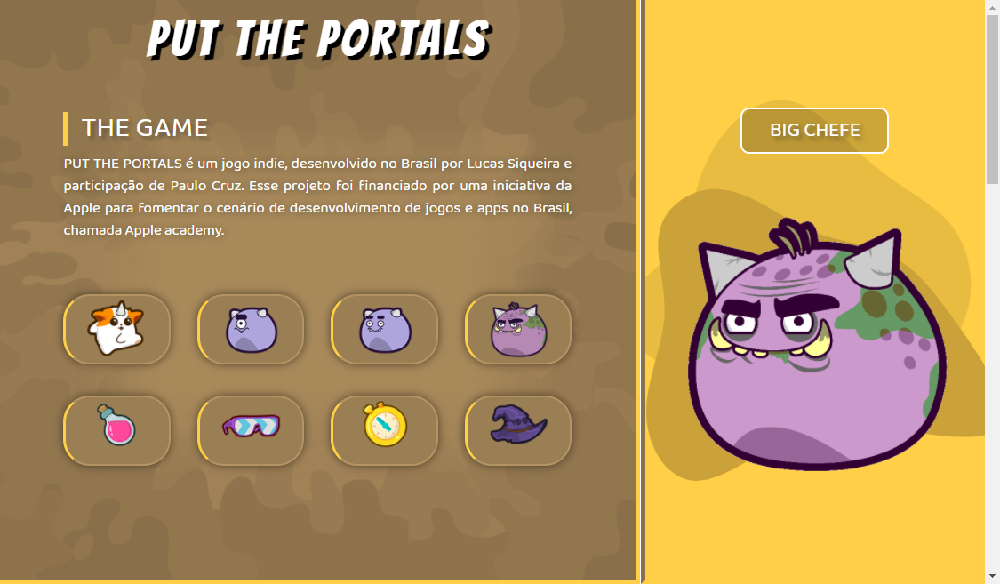

# Put The Portals
 

Introdução
Put The Portals é um game indie, que se passa em uma floresta mágica, onde o jogador deverá resolver quebra-cabeças para derrotar seus inimigos. Foi desenvolvido dentro da Apple Academy, uma iniciativa Apple para fomentar o cenário de desenvolvimento de jogos e apps no Brasil, em parceria com a Universidade Católica de Brasília.

Descrição
O Jogador usará portais para se locomover, com isso terá que atingir todos os inimigos do mapa, para então conseguir sua vitória, ele também contará com uma série de itens especiais que o ajudarão nessa jornada, como o chapéu da sabedoria e o cronometro dourado.

Itens especiais
O jogador certamente enfrentará desafios complexos, nesses momentos ele poderá usar itens especiais, que podem mostrar o caminho inicial do desafio, traçar suas rotas em meio aos portais e até mesmo parar o tempo para que o jogador consiga resolver o desafio sem se preocupar com o relógio.
